# Dissertation Repository

## Overview

This repository contains the code, datasets, and supporting documentation for the dissertation titled:

**"An Empirical Meta-Evaluation of Language Model Evaluation Methods for Systems Engineering Using Distractor Sensitivity and Consensus Judging"**

This research focuses on meta-evaluation, the systematic evaluation of language model evaluation methods themselves, within the context of Systems Engineering (SE). The study leverages the existing SysEngBench benchmark as its empirical foundation and extends it through the creation of Open-Style Question (OSQ) variants derived from the original Multiple-Choice Question (MCQ) dataset.

Specifically, this work investigates:
- Comparative behavior of **MCQ and OSQ evaluation modalities**,
- The sensitivity of MCQ-based evaluation to **distractor variation**,
- The reliability and agreement of **LLM-as-a-Judge** evaluation using **rubric-based scoring**, and
- **Consensus and correlation** across multiple language model judges.

The OSQ dataset is systematically constructed from SysEngBench to preserve domain coverage and conceptual equivalence while enabling open-ended response evaluation. All evaluations are conducted on domain-specific Systems Engineering content aligned with established INCOSE Handbook categories, with the goal of assessing evaluation robustness, consistency, and interpretability across modalities.

The original **SysEngBench** benchmark dataset is publicly available on [HuggingFace](https://huggingface.co/datasets/rabell/SysEngBench) and is used in this repository without modification. The derived OSQ dataset, along with all evaluation pipelines and analysis code, is provided to support reproducibility and further meta-evaluation research. It is also publicly available on [HuggingFace](https://huggingface.co/datasets/rabell/SysEngBench-OSQ) 

A more easily navigatable way for this research is on the Github.io [website](https://ryan-a-bell.github.io/dissertation/).

## Repository Structure

```
dissertation/
├── docs/                       # Project documentation (built with MkDocs)
├── manuscript/                 # Dissertation manuscript (Overleaf snapshots)
├── metaeval/                   # CLI tool for running the meta-evaluation
├── metaeval-test/              # Tests for the metaeval CLI tool
├── viz/                        # Visualization outputs
├── src/                        # Source code organized by evaluation phases
│   ├── phase1_prep/            # Initial dataset tagging and preprocessing
│   ├── phase2_conversion/      # Conversion of MCQs to OSQs
│   ├── phase3_variants/        # Generation of distractor variant MCQs
│   ├── phase4_inference/       # Inference code for evaluating language models
│   ├── phase5_llm_as_a_judge/  # LLM-as-a-Judge grading of OSQ responses
│   └── phase6_analysis/        # Comprehensive statistical analysis and visualization
├── scripts/                    # Automation scripts (e.g., generate_docs.py)
├── .github/                    # GitHub CI workflows
├── .env.template               # Template for API keys
├── requirements.txt            # Python dependencies for venv
├── Makefile                    # Automation commands
└── README.md                   # Project overview (this file)
```

## Getting Started

### Environment Setup

This repository leverages Python's built-in **venv** for dependency management.

#### Using venv

```bash
python -m venv venv
source venv/bin/activate
pip install -r requirements.txt
```

#### (If using CLI tool) Installing metaeval
```bash
pip install -e metaeval
```

### API Keys

Copy the `.env.template` file to `.env` and populate it with your required API keys.

## Documentation

Detailed documentation can be found under the `docs/` directory. Built documentation is served using MkDocs. To ensure you are viewing the latest version of the documentation locally, use the following command which generates the documentation before serving it.

**Note**: The `docs/source-code` directory is procedurally generated by the `generate_docs.py` script. Any files manually placed here may be overwritten or removed during documentation updates. Store important documents in other directories such as `src/` or other `docs/` subdirectories to ensure they are preserved.

### Viewing the documentation locally

First, install the dependencies. Second, run `python scripts/generate_docs.py` to update the `docs/source-code` folder with the latest content and then you serve it using `mkdocs serve`. After running, open your browser to `http://127.0.0.1:8000` to view the documentation.

1. Install dependencies:
   ```bash
   pip install -r requirements.txt
   ```
2. Generate documentation and start the server:
   ```bash
   python scripts/generate_docs.py
   mkdocs serve
   ```

### Viewing the documentation on the GitHub Page and the CI/CD process

The source for the github page is `https://ryan-a-bell.github.io/dissertation/`.


### Github Pages Website
A CI/CD pipeline is configured to host all of the documentation for this project on GitHub Pages. This pipeline is triggered on pushes to the `main` branch.

The hosted information is populated from the `docs/` folder. During the CI/CD process, the pipeline runs `python scripts/generate_docs.py` to update the `docs/` folder with the latest content, including Jupyter notebooks from the Phase folders and other relevant documentation. Following this, it deploys the updated documentation to GitHub Pages using `mkdocs gh-deploy --force`.

### Documentation System Architecture

The documentation system uses several components that work together:

```mermaid
flowchart TD
    subgraph "Local Development"
        dev[Developer]
        make[Makefile]
        script[scripts/generate_docs.py]
        mkdocs[mkdocs.yml]
        docs[docs/ directory]
        site[Local Site]
        
        dev -->|"make docs-serve"| make
        make -->|"Executes"| script
        script -->|"Scans project files"| project[Project Files]
        script -->|"Generates"| mkdocs
        script -->|"Copies files to"| docs
        mkdocs -->|"Configures"| site
        docs -->|"Content for"| site
    end
    
    subgraph "Automated Deployment"
        push[Push to main/master]
        ci[.github/workflows/ci.yml]
        gh_script[scripts/generate_docs.py]
        gh_mkdocs[mkdocs.yml]
        gh_docs[docs/ directory]
        gh_pages[GitHub Pages]
        
        push -->|"Triggers"| ci
        ci -->|"Executes"| gh_script
        gh_script -->|"Scans project files"| gh_project[Project Files]
        gh_script -->|"Generates"| gh_mkdocs
        gh_script -->|"Copies files to"| gh_docs
        ci -->|"Runs mkdocs gh-deploy"| gh_pages
        gh_mkdocs -->|"Configures"| gh_pages
        gh_docs -->|"Content for"| gh_pages
    end
```



### Key Relationships:

1. **scripts/generate_docs.py** is the central component that:
   - Scans the project for documentation files (.md, .ipynb, .pdf, .csv)
   - Copies relevant files to the docs/ directory
   - Dynamically generates the mkdocs.yml configuration

2. **mkdocs.yml** is generated automatically and should not be manually edited

3. **Makefile** provides convenient commands for local documentation tasks

4. **.github/workflows/ci.yml** automates the documentation deployment process to GitHub Pages

This architecture ensures documentation stays in sync with your project files and is automatically deployed when changes are pushed to the main branch.

## Contributions

This work is in support of a PhD in Systems Engineering.

