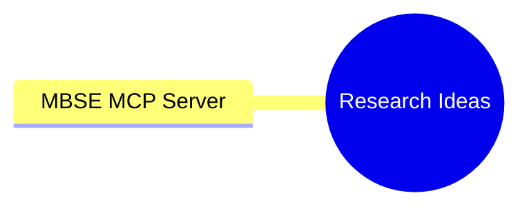

# AI Tools and MCP Servers Mindmap

This mindmap is for brainstorming research ideas related to using AI with Systems Engineering.

## AI Tools for Systems Engineering Research

MCP Info:
- https://www.dailydoseofds.com/model-context-protocol-crash-course-part-8/