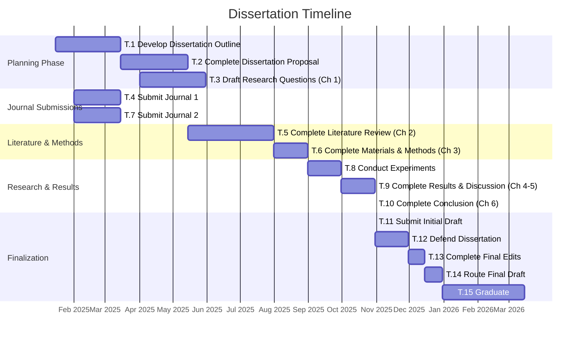

# Dissertation Timeline Gantt Chart

This Gantt chart visualizes the dissertation schedule, showing tasks, their durations, and dependencies. The vertical line represents today's date (July 22, 2025) to track progress against the planned timeline.

## Timeline Notes

- **Current Date**: July 22, 2025
- **Completed Tasks**: T.1-T.4, T.7 (Dissertation Outline, Journal Submissions)
- **In Progress**: T.5 (Literature Review)
- **Upcoming**: T.6-T.15 (Methods, Experiments, Results, Defense, Graduation)

## Task Details

| Task ID | Description | Start Date | Completion Date |
|---------|-------------|------------|-----------------|
| T.1 | Develop Dissertation Outline | Jan 2025 | March 2025 |
| T.2 | Complete Dissertation Proposal | March 2025 | May 2025 |
| T.3 | Draft Research Questions and Objectives (Chapter 1) | April 2025 | May 2025 |
| T.4 | Submit Journal 1 | Feb 2025 | March 2025 |
| T.5 | Complete Literature Review (Chapter 2) | May 2025 | July 2025 |
| T.6 | Complete Materials and Methods (Chapter 3) | Aug 2025 | Aug 2025 |
| T.7 | Submit Journal 2 | Feb 2025 | March 2025 |
| T.8 | Conduct Experiments to get Results | Aug 2025 | Sept 2025 |
| T.9 | Complete Results and Discussion (Chapter 4 and 5) | Sept 2025 | Oct 2025 |
| T.10 | Complete Conclusion (Chapter 6) | Oct 2025 | Oct 2025 |
| T.11 | Complete Dissertation Formatting and Submit Initial Draft | Oct 2025 | Oct 2025 |
| T.12 | Defend Dissertation | Nov 2025 | Nov 2025 |
| T.13 | Complete Final Edits and Submit to TPO and Department Chair | Dec 2025 | Dec 2025 |
| T.14 | Route Final Draft | Dec 2025 | Dec 2025 |
| T.15 | Graduate | Jan 2026 | March 2026 |

The Gantt chart provides a visual representation of the dissertation timeline, showing task dependencies and progress. The "today" marker helps track current progress against the planned schedule.
