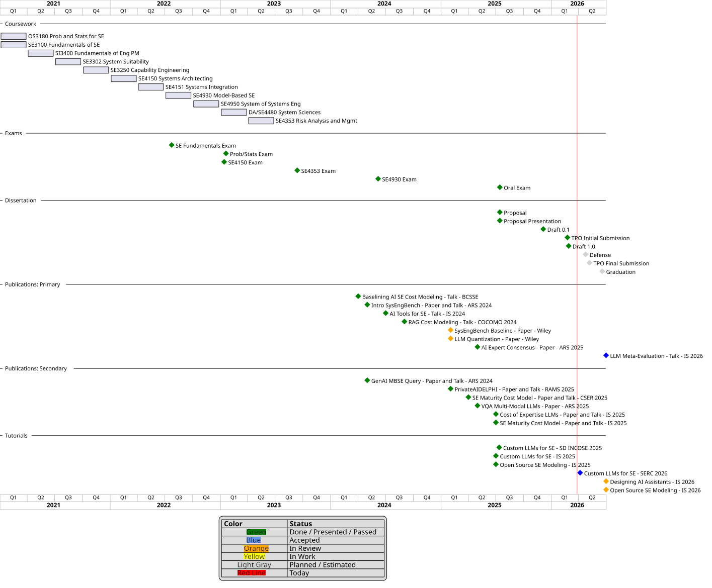

<div class="hero-banner" markdown>

</div>

# An Empirical Meta-Evaluation of Language Model Evaluation Methods for Systems Engineering Using Distractor Sensitivity and Consensus Judging

 **Ryan Bell**<br>Naval Postgraduate School<br>PhD Candidate in Systems Engineering

---

## Abstract

This research focuses on meta-evaluation -- the systematic evaluation of language model evaluation methods themselves -- within the context of Systems Engineering (SE). The study leverages the existing SysEngBench benchmark as its empirical foundation and extends it through the creation of Open-Style Question (OSQ) variants derived from the original Multiple-Choice Question (MCQ) dataset.

Specifically, this work investigates:
- Comparative behavior of **MCQ and OSQ evaluation modalities**,
- The sensitivity of MCQ-based evaluation to **distractor variation**,
- The reliability and agreement of **LLM-as-a-Judge** evaluation using **rubric-based scoring**, and
- **Consensus and correlation** across multiple language model judges.

The OSQ dataset is systematically constructed from SysEngBench to preserve domain coverage and conceptual equivalence while enabling open-ended response evaluation. All evaluations are conducted on domain-specific Systems Engineering content aligned with established INCOSE Handbook categories, with the goal of assessing evaluation robustness, consistency, and interpretability across modalities.

The original **SysEngBench** benchmark dataset is publicly available on [HuggingFace](https://huggingface.co/datasets/rabell/SysEngBench) and is used in this repository without modification. The derived OSQ dataset, along with all evaluation pipelines and analysis code, is provided to support reproducibility and further meta-evaluation research. It is also publicly available on [HuggingFace](https://huggingface.co/datasets/rabell/SysEngBench-OSQ).

## Repository Evolution

This animated visualization shows the evolution of the dissertation repository over time, generated using [Gource](https://gource.io/).

<video controls width="100%" poster="">
  <source src="assets/repo_lineage.mp4" type="video/mp4">
  Your browser does not support the video tag.
</video>

## Key Contributions

<div class="research-grid" markdown>
<div class="research-card" markdown>
### Contribution 1
**Extension of SysEngBench with Multi-Format Evaluation Questions**

Extends the SysEngBench benchmark to support paired multiple-choice and open-style question formats, enabling controlled within-task comparisons across modalities while preserving domain fidelity.
</div>
<div class="research-card" markdown>
### Contribution 2
**Robustness Analysis of MCQ Evaluation Using Distractor Variation**

Investigates how sensitive MCQ performance is to distractor design choices, framing robustness as a measurement property and highlighting risks of overconfidence when MCQ results are interpreted without considering structural dependencies.
</div>
<div class="research-card" markdown>
### Contribution 3
**Evaluation Modality Fusion for Model Qualification**

Develops a modality-aware basis for model qualification that aligns evaluation evidence with task characteristics, framing qualification as a systems engineering decision problem informed by task criticality and acceptable failure modes.
</div>
<div class="research-card" markdown>
### Contribution 4
**Token-Efficient Qualification: Cost-Aware Response Length Trade-offs**

Frames model evaluation as a trade-space extending beyond accuracy to include computational cost and response length, establishing cost-aware evaluation as a component of LLM adoption in systems engineering.
</div>
</div>

## Key Findings and Practical Guidance

A synthesis of the dissertation's central results: implications for SE benchmarking methodology, task-to-modality routing guidance, and cost-aware model selection rules for practitioners.

[View Key Findings](key-findings.md){ .nps-button }

## Quick Links

<div class="research-grid" markdown>
<div class="research-card" markdown>
### Datasets on HuggingFace

| Dataset | Description |
|---------|-------------|
| [SysEngBench](https://huggingface.co/datasets/rabell/SysEngBench) | Original MCQ benchmark |
| [SysEngBench-A](https://huggingface.co/datasets/rabell/SysEngBench-A) | Correct answer at position A |
| [SysEngBench-B](https://huggingface.co/datasets/rabell/SysEngBench-B) | Correct answer at position B |
| [SysEngBench-C](https://huggingface.co/datasets/rabell/SysEngBench-C) | Correct answer at position C |
| [SysEngBench-D](https://huggingface.co/datasets/rabell/SysEngBench-D) | Correct answer at position D |
| [SysEngBench-OSQ](https://huggingface.co/datasets/rabell/SysEngBench-OSQ) | Open-Style Questions |

</div>
<div class="research-card" markdown>
### Publications
Conference papers and journal submissions
[View Publications](publications/){ .nps-button }
</div>
<div class="research-card" markdown>
### Source Code
6-phase research pipeline
[Explore Code](source-code/){ .nps-button }
</div>
</div>

## Dissertation Timeline



??? note "PlantUML Source"
    The source for this timeline is located in [`docs/assets/timeline.puml`](assets/timeline.puml).

---

## Developer Reference

??? note "Repository Structure"
    ```
    dissertation/
    ├── assets/                # Storage for Files
    ├── docs/                  # Project documentation (built with MkDocs)
    ├── src/                   # Source code organized by evaluation phases
    │   ├── phase1_prep/       # Initial dataset tagging and preprocessing
    │   ├── phase2_conversion/ # Conversion of MCQs to OSQs
    │   ├── phase3_variants/   # Generation of distractor variant MCQs
    │   ├── phase4_inference/        # Inference code for evaluating language models
    │   ├── phase5_llm_as_a_judge/  # LLM-as-a-Judge rubric-based scoring
    │   └── phase6_analysis/        # Statistical analysis and visualization
    ├── .github/               # GitHub CI workflows
    ├── .env.template          # Template for API keys
    ├── requirements.txt       # Python dependencies for venv
    ├── Makefile               # Automation commands
    ├── README.md              # Project overview (this file)
    └── LICENSE                # License information
    ```

??? note "Environment Setup"
    This repository leverages Python's built-in **venv** for dependency management.

    ```bash
    python -m venv venv
    source venv/bin/activate
    pip install -r requirements.txt
    ```

    Copy the `.env.template` file to `.env` and populate it with your required API keys.

??? note "Viewing Documentation Locally"
    Install dependencies, then generate and serve:

    ```bash
    pip install -r requirements.txt
    python scripts/generate_docs.py
    mkdocs serve
    ```

    Open your browser to `http://127.0.0.1:8000`.

    **Note**: The `docs/source-code` directory is procedurally generated by `generate_docs.py`. Any files manually placed there may be overwritten.

??? note "GitHub Pages CI/CD"
    A CI/CD pipeline deploys documentation to GitHub Pages on pushes to `main`. The pipeline runs `generate_docs.py` to update the `docs/` folder, then deploys via `mkdocs gh-deploy --force`.

    The hosted site is at `https://ryan-a-bell.github.io/dissertation/`.

??? note "Documentation System Architecture"
    ```mermaid
    flowchart TD
        subgraph "Local Development"
            dev[Developer]
            make[Makefile]
            script[scripts/generate_docs.py]
            mkdocs[mkdocs.yml]
            docs[docs/ directory]
            site[Local Site]

            dev -->|"make docs-serve"| make
            make -->|"Executes"| script
            script -->|"Scans project files"| project[Project Files]
            script -->|"Generates"| mkdocs
            script -->|"Copies files to"| docs
            mkdocs -->|"Configures"| site
            docs -->|"Content for"| site
        end

        subgraph "Automated Deployment"
            push[Push to main/master]
            ci[.github/workflows/ci.yml]
            gh_script[scripts/generate_docs.py]
            gh_mkdocs[mkdocs.yml]
            gh_docs[docs/ directory]
            gh_pages[GitHub Pages]

            push -->|"Triggers"| ci
            ci -->|"Executes"| gh_script
            gh_script -->|"Scans project files"| gh_project[Project Files]
            gh_script -->|"Generates"| gh_mkdocs
            gh_script -->|"Copies files to"| gh_docs
            ci -->|"Runs mkdocs gh-deploy"| gh_pages
            gh_mkdocs -->|"Configures"| gh_pages
            gh_docs -->|"Content for"| gh_pages
        end
    ```

## Contributions

This work is in support of a PhD in Systems Engineering.

## License

This repository is provided under the [MIT License](../LICENSE).

<div style="text-align: center;" markdown>

**Scan to Visit This Site**


`https://ryan-a-bell.github.io/dissertation/`

</div>
