# Dissertation Repository

## Overview

This repository contains code, datasets, and documentation supporting the dissertation titled:

**"Evaluation Modality Alignment to Systems Engineering Task Types: A Methodological Study of Language Models' Domain-Specific and Task-Specific Effectiveness Using Distractor Variation and Consensus-Based Grading."**

The research systematically benchmarks Large Language Models (LLMs) using multiple evaluation modalities (Multiple-Choice Questions \[MCQ] and Open-Style Questions \[OSQ]) across Systems Engineering (SE) tasks aligned to INCOSE Handbook categories.

The benchmark dataset, **SysEngBench**, is publicly available on [HuggingFace](https://huggingface.co/datasets/rabell/SysEngBench).

## Repository Structure

```
dissertation/
├── assets/                # Storage for Files
├── docs/                  # Project documentation (built with MkDocs)
├── src/                   # Source code organized by evaluation phases
│   ├── phase1_prep/       # Initial dataset tagging and preprocessing
│   ├── phase2_conversion/ # Conversion of MCQs to OSQs
│   ├── phase3_variants/   # Generation of distractor variant MCQs
│   ├── phase4_inference/  # Inference code for evaluating language models
│   ├── phase5_metrics/    # Calculation of evaluation metrics
│   └── phase6_tables/     # Aggregation and summary table generation
|   └── phase7_analysis/   # Analysis of the previous phases
├── .github/               # GitHub CI workflows
├── .env.template          # Template for API keys
├── requirements.txt       # Python dependencies for venv
├── Makefile               # Automation commands
├── README.md              # Project overview (this file)
└── LICENSE                # License information
```

## Getting Started

### Environment Setup

You can use either **Conda** or Python's built-in **venv** for dependency management.

#### Using venv

```bash
python -m venv venv
source venv/bin/activate
pip install -r requirements.txt
```

### API Keys

Copy the `.env.template` file to `.env` and populate it with your required API keys.

## Documentation

Detailed documentation can be found under the `docs/` directory. Built documentation is served using MkDocs. To ensure you are viewing the latest version of the documentation locally, use the following command which generates the documentation before serving it:

**Note**: The `docs/` directory is procedurally generated by the `generate_docs.py` script. Any files manually placed here may be overwritten or removed during documentation updates. Store important documents in other directories such as `src/` or `assets/` to ensure they are preserved.

```bash
mkdocs serve
```

First, run `python scripts/generate_docs.py` to update the `docs/` folder with the latest content and then you serve it using `mkdocs serve`. After running, open your browser to `http://127.0.0.1:8000` to view the documentation.

If you don't have `make` installed or prefer manual steps, you can run:

```bash
pip install mkdocs mkdocs-material mkdocs-jupyter
python scripts/generate_docs.py
mkdocs serve
```

## Github Pages Website
A CI/CD pipeline is configured to host all of the documentation for this project on GitHub Pages. This pipeline is triggered on pushes to the `main` branch.

The hosted information is populated from the `docs/` folder. During the CI/CD process, the pipeline runs `python scripts/generate_docs.py` to update the `docs/` folder with the latest content, including Jupyter notebooks from the Phase folders and other relevant documentation. Following this, it deploys the updated documentation to GitHub Pages using `mkdocs gh-deploy --force`.

## Documentation System Architecture

The documentation system uses several components that work together:

```mermaid
flowchart TD
    subgraph "Local Development"
        dev[Developer]
        make[Makefile]
        script[scripts/generate_docs.py]
        mkdocs[mkdocs.yml]
        docs[docs/ directory]
        site[Local Site]
        
        dev -->|"make docs-serve"| make
        make -->|"Executes"| script
        script -->|"Scans project files"| project[Project Files]
        script -->|"Generates"| mkdocs
        script -->|"Copies files to"| docs
        mkdocs -->|"Configures"| site
        docs -->|"Content for"| site
    end
    
    subgraph "Automated Deployment"
        push[Push to main/master]
        ci[.github/workflows/ci.yml]
        gh_script[scripts/generate_docs.py]
        gh_mkdocs[mkdocs.yml]
        gh_docs[docs/ directory]
        gh_pages[GitHub Pages]
        
        push -->|"Triggers"| ci
        ci -->|"Executes"| gh_script
        gh_script -->|"Scans project files"| gh_project[Project Files]
        gh_script -->|"Generates"| gh_mkdocs
        gh_script -->|"Copies files to"| gh_docs
        ci -->|"Runs mkdocs gh-deploy"| gh_pages
        gh_mkdocs -->|"Configures"| gh_pages
        gh_docs -->|"Content for"| gh_pages
    end
```



### Key Relationships:

1. **scripts/generate_docs.py** is the central component that:
   - Scans the project for documentation files (.md, .ipynb, .pdf, .csv)
   - Copies relevant files to the docs/ directory
   - Dynamically generates the mkdocs.yml configuration

2. **mkdocs.yml** is generated automatically and should not be manually edited

3. **Makefile** provides convenient commands for local documentation tasks

4. **.github/workflows/ci.yml** automates the documentation deployment process to GitHub Pages

This architecture ensures documentation stays in sync with your project files and is automatically deployed when changes are pushed to the main branch.

## Contributions

This work is in support of a PhD in Systems Engineering.

## License

This repository is provided under the [MIT License](../LICENSE).


## New Docs process

### Local Development

1. Install dependencies:
   ```bash
   pip install -r requirements.txt
   ```
2. Generate documentation:
   ```bash
   python scripts/generate_docs.py
   mkdocs serve
   ```

### Deployment

Documentation is deployed automatically via GitHub Actions on pushes to `main`.