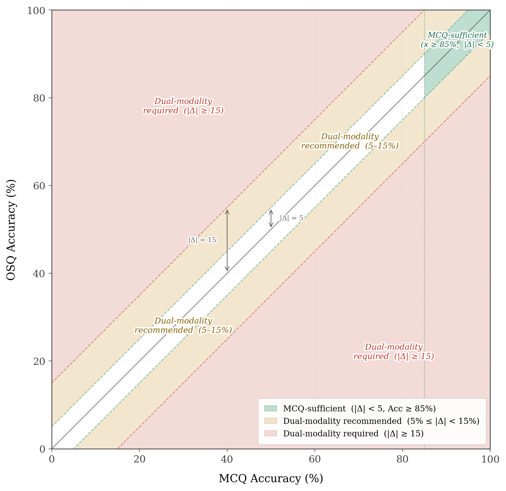

# Key Findings and Practical Guidance

This page synthesizes the dissertation's central findings into actionable takeaways for systems engineers and benchmarking practitioners. The content draws from Chapter 5 (Implications for SE Benchmarking Methodology) and Chapter 6 (Practical Applications for Systems Engineering).

---

## Implications for SE Benchmarking Methodology

The empirical evidence demonstrates that evaluation modality, robustness controls, and resource accounting are all required to determine the scope and defensibility of a performance claim. These five implications translate the findings into recommendations for defensible benchmarking practice.

### Implication 1: Modality Is Part of the Evaluation Design

Modality choice is part of the claim being made. MCQ outcomes support claims about *recognition competence* under constrained response form, while OSQ outcomes support claims about *generative competence* under rubric-scored explanations. Benchmarks should explicitly state which claim tier is supported by the reported evidence:

| Tier | Claim Type | Evidence Basis |
|------|-----------|----------------|
| **Tier 1** | Recognition competence | MCQ: ability to select correct answers under fixed options and distractors |
| **Tier 2** | Generative competence | OSQ: ability to generate rubric-satisfying responses |
| **Tier 3** | Hybrid competence | Integrated MCQ + OSQ outcomes with robustness and feasibility checks |

It is methodologically inadvisable to treat MCQ and OSQ as interchangeable measures of capability without explicitly constraining the claim to the tier supported by the evidence.

### Implication 2: Measurement Instrument Robustness Must Be Recorded

MCQ results should not be treated as fully objective unless robustness to presentation artifacts is measured. Position effects and distractor configuration can induce systematic shifts in observed MCQ accuracy, creating comparability risk when different models respond differently to the same superficial perturbations. Benchmarks should include and report robustness checks as part of the default MCQ protocol---rotated variants, effect sizes, and whether positional sensitivity is present.

Similarly, OSQ scoring should not be treated as a single "judge truth." Multi-judge scoring, agreement statistics, and explicit reporting of judge-dependent differences provide a minimum reliability scaffold for generative evaluation. Robustness reporting bounds how much the reported metric depends on the measurement instrument rather than the model's underlying capability.

### Implication 3: Minimum Evidence Bundles Should Be Task-Family Aware

Cross-modality separation is category-dependent, so the evidence needed to support a defensible claim must also be category-dependent. Where MCQ and OSQ diverge more strongly, MCQ-only results are more likely to overstate deployable competence. Results should be reported as *evaluation profiles* rather than single summary scores:

| Profile | Evidence Requirements | Use Case |
|---------|----------------------|----------|
| **Profile A (Screening)** | MCQ accuracy + MCQ robustness checks with variance reporting | Broad capability stratification |
| **Profile B (Dual-modality)** | Profile A + OSQ rubric scoring + multi-judge reliability + score distributions | Qualification for generative tasks |
| **Profile C (Cost-aware)** | Profile B + tokenomics (length distributions, quality yield, efficiency frontier) | Deployment decisions under budget and latency constraints |

### Implication 4: Reporting Standards Should Support Auditability and Reuse

At minimum, a benchmark report should include:

1. **Modality-separated outcomes** -- MCQ accuracy and OSQ score distributions, not only aggregated means.
2. **Cross-modality evidence** -- Deltas and a decision mapping indicating whether modalities are interchangeable, correlated-but-not-interchangeable, or divergent for the target task family.
3. **Robustness controls** -- MCQ artifact sensitivity (e.g., answer position) and OSQ judge sensitivity (e.g., agreement).
4. **Tokenomics** -- Token usage distributions by quality tier and an efficiency frontier linking quality to cost.
5. **Traceability artifacts** -- Run configuration, prompts, rubric definitions, and parsing/error rates sufficient to reproduce scoring.

This reporting package ensures that downstream users can select an evaluation modality consistent with their intended claim, compare models without conflating instrument artifacts with capability, and reason about cost-quality tradeoffs.

### Implication 5: Benchmarks Must Anticipate Saturation and Evolve

Portions of the benchmark can saturate under MCQ and, in limited cases, under OSQ. Saturation reduces discriminative power and can create misleading impressions of equivalence among strong models. Benchmark maintenance should include:

- Periodic difficulty rebalancing
- Targeted item refresh for saturated categories
- Reporting of saturation indicators (e.g., fraction of 100% cells, ceiling proximity)

In a qualification framing, saturation is a governance issue because it limits the benchmark's ability to support defensible comparative claims over time.

---

## Practical Applications for Systems Engineers

The dissertation's central deployment takeaway is that benchmark evidence is most actionable when translated into *decision rules*. Rather than selecting a single "best" model and treating it as uniformly reliable, practitioners can operationalize the findings through three linked practices.

### Model Selection Guidance by Task Type

Model selection should be guided not only by average benchmark performance, but by how well a model's measured strengths align with the target task's evidence requirements. This is made explicit through a **task-to-modality routing map**: a category-driven rule set that specifies the minimum defensible qualification modality for each task class.

!!! note "Risk Profile Disclaimer"
    The classification thresholds used below (e.g., dual-modality required at delta >= 15%, MCQ-sufficient at delta < 5% with MCQ accuracy >= 85%) reflect the **risk profile adopted for this research**, informed by engineering judgement regarding acceptable evidence standards for systems engineering tasks. These thresholds are not universal constants. Practitioners applying this same framework may adjust the classification boundaries to match their own organizational risk tolerance for AI/LLM adoption. The figure below illustrates the classification regions and how they partition the evaluation space -- adapting these regions to a different risk profile is a straightforward extension of the methodology.

<figure markdown="span">
  { width="700" }
  <figcaption>Classification regions used to map INCOSE task categories to minimum qualification modalities. The boundaries can be adjusted to reflect different risk tolerances for LLM adoption.</figcaption>
</figure>

Seven INCOSE categories are classified as **dual-modality required** (mean MCQ-OSQ delta >= 15%):

| Category | MCQ-OSQ Delta |
|----------|:------------:|
| Modeling and Simulation | +19.6% |
| Modeling Frameworks and Methods | +18.6% |
| Decision Management, Analysis of Alternatives, and Tradespace Analysis | +18.2% |
| System Safety Engineering | +17.6% |
| Configuration and Information Management | +16.5% |
| Usability and Human Systems Integration | +15.7% |
| Risk and Opportunity Management | +15.4% |

For these categories, MCQ-only evaluation carries substantial risk of overestimating model readiness for tasks that inherently require constructed justification rather than option selection. No category in SysEngBench reaches the MCQ-sufficient classification (delta < 5% with MCQ accuracy >= 85%), meaning the entire taxonomy exhibits meaningful modality sensitivity.

Operationally, the routing map can be implemented as a simple policy table that maps task families to an evidence requirement. This counters a common shortcut in practice: treating multiple-choice benchmark performance as a stand-in for readiness across the full range of SE work products.

### Benchmark-Informed SE Workflow Integration

Benchmark results provide the evidence needed to select LLMs for integration into SE workflows as **role-assigned copilots** rather than general-purpose assistants. The findings support *evidence fusion*: MCQ and OSQ provide overlapping but non-identical signals, and each is informative for selecting models that fit specific workflow roles.

- **MCQ-qualified models** can be assigned to conformance checks, structured validation prompts, and constrained-response tasks where recognition competence is the primary requirement.
- **OSQ-qualified models** can be assigned to drafting explanations, justification narratives, trade studies, and other free-text work products where generative adequacy is the primary success criterion.

This perspective generalizes naturally to MBSE. As models and documents become repository-managed and increasingly text-addressable, copilot design can follow established software engineering patterns: bounded change sets, schema-constrained outputs, automated checks, and human review at defined decision points. Benchmark evidence becomes the justification for *where* automation could be leveraged successfully and *how* it is bounded.

### Budgeting and Token Constraints

The tokenomics results make feasibility and cost explicit. Response verbosity varies widely across models, and longer responses do not reliably produce higher judged quality. The cost-aware selection rule is:

> **Qualify first, then select the lowest-token model among those meeting the required quality threshold.**

Models are filtered for acceptable OSQ performance (e.g., at or above a "Good" or "Pass" threshold), and then compared on efficiency using the quality-token trade space. Under comparable judged performance, the most cost-effective choice is the model that meets the required quality threshold using fewer median tokens per response.

This enables practitioners to translate tokenomics evidence into cost-conscious model deployments, enforcing token and format constraints as part of the workflow's configuration-controlled operating procedure.

---

## Summary

The findings establish a qualification-oriented stance for benchmarking and LLM adoption in systems engineering:

1. **Modality defines the scope** of the performance claim.
2. **Robustness controls bound** measurement sensitivity.
3. **Evaluation profiles** provide minimum evidence requirements conditional on SE task family.
4. **Reporting standards** enable auditability and reuse.
5. **Saturation** motivates benchmark governance and refresh.
6. **Task-to-modality routing** operationalizes evaluation evidence into model selection decisions.
7. **Cost-aware qualification** ensures deployment feasibility under real-world constraints.

Together, these translate *what* must be measured and reported into *how* practicing systems engineers should operationalize these requirements in day-to-day workflows.
