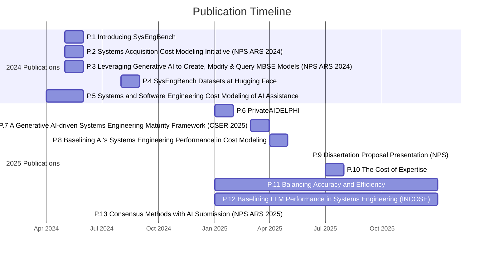

# Publication Timeline Gantt Chart

This Gantt chart visualizes the publication timeline based on completed and planned publications from the publications folder. The vertical line represents today's date to track progress against the actual publication schedule.

## Publication Details

| Publication ID | Title | Venue | Publication Date | Authors |
|----------------|-------|--------|------------------|---------|
| P.1 | Introducing SysEngBench: A Novel Benchmark for Assessing Large Language Models | INCOSE International Symposium 2024 | May 2024 | Bell, Madachy, Longshore |
| P.2 | Systems Acquisition Cost Modeling Initiative for AI Assistance | NPS Acquisition Research Symposium 2024 | May 2024 | Madachy, Bell, Longshore |
| P.3 | Leveraging Generative AI to Create, Modify, and Query MBSE Models | NPS Acquisition Research Symposium 2024 | May 2024 | Longshore, Madachy, Bell |
| P.4 | Rabell/SysEngBench Datasets at Hugging Face | Hugging Face Datasets | August 2024 | Bell |
| P.5 | Systems and Software Engineering Cost Modeling of AI Assistance | Presentation | April 2024 | Madachy, Longshore, Bell |
| P.6 | PrivateAIDELPHI: Adopting and Adapting Private AI for Risk Assessment | Reliability & Maintainability Symposium 2025 | January 2025 | Papakonstantinou, et al. |
| P.7 | A Generative AI-driven Systems Engineering Maturity and Cost Modeling Framework | Conference on Systems Engineering Research 2025 | March 2025 | Madachy, Bell, Longshore |
| P.8 | Baselining AI's Systems Engineering Performance in Cost Modeling | Presentation | April 2024 (from BibTeX) | Bell, Longshore, Madachy |
| P.9 | Dissertation Proposal Presentation | NPS Presentation | June 2025 | Bell  |
| P.10 | The Cost of Expertise: Performance Trade-Offs in LLMs for Systems Engineering | INCOSE International Symposium 2025 | July 2025 | Wach, Bell, et al. |
| P.11 | Balancing Accuracy and Efficiency: Trade-offs in Large Language Model Quantization | Wiley INCOSE | 2025 | Bell, Madachy, Longshore |
| P.12 | Baselining Large Language Model Performance in Systems Engineering Using SysEngBench | Wiley INCOSE | 2025 | Bell, Longshore, Madachy, Hanrahan |
| P.13 | Consensus Methods with AI - Submission | NPS Acquisition Research Symposium 2025 | April 2025 | Submission |

