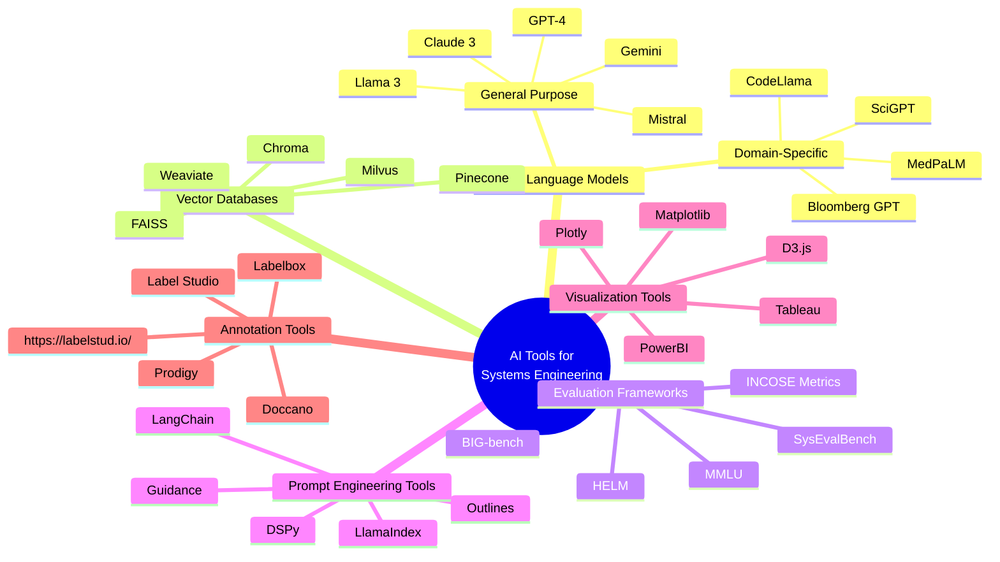
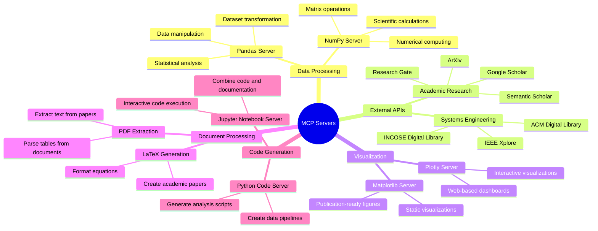
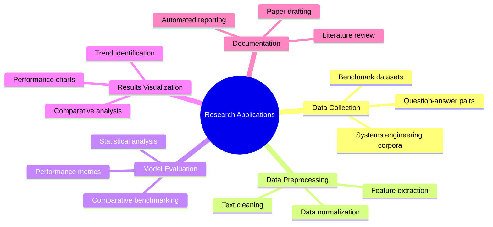

# AI Tools and MCP Servers Mindmap

This document provides a comprehensive mindmap of AI tools and Model Context Protocol (MCP) servers that can be leveraged for systems engineering research and evaluation.

## AI Tools for Systems Engineering Research

## MCP Servers for Enhanced Capabilities

MCP (Model Context Protocol) servers extend the capabilities of AI assistants by providing access to external tools and resources. Here are some relevant MCP servers that could be integrated into your research workflow:

## Applications in Dissertation Research

These tools can be applied to various aspects of your dissertation research:

