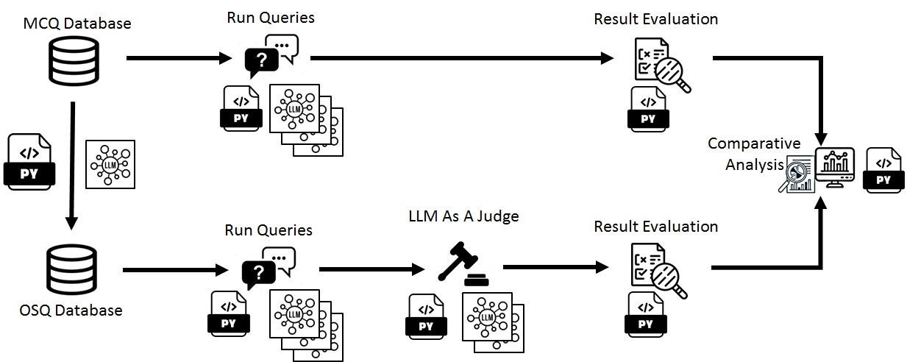

<a href="index.md" class="active">Overview</a>
<a href="phase1_prep/index.md">Phase 1</a>
<a href="phase2_conversion/index.md">Phase 2</a>
<a href="phase3_variants/index.md">Phase 3</a>
<a href="phase4_inference/index.md">Phase 4</a>
<a href="phase5_llm_as_a_judge/index.md">Phase 5</a>
<a href="phase6_analysis/index.md">Phase 6</a>

# Source Code

This dissertation implements a six-phase modality evaluation pipeline that transforms the SysEngBench dataset through deterministic dataset derivation procedures, evaluates LLMs across both MCQ and OSQ formats under standardized inference controls, applies rubric-based LLM-as-a-Judge scoring for open responses, and performs statistical analyses tailored to each research objective.

---

## Phases

| Phase | Description | Key Output |
|-------|-------------|------------|
| [Phase 1: Benchmark Preparation](phase1_prep/index.md) | Download SysEngBench from HuggingFace, explore data, analyze benchmark composition | 1,144 MCQs with INCOSE category distribution |
| [Phase 2: MCQ to OSQ Conversion](phase2_conversion/index.md) | LLM-based two-stage pipeline to convert MCQs to open-ended questions with rubrics | 845 converted OSQs (73.9% conversion rate) |
| [Phase 3: MCQ Golden Answer Variants](phase3_variants/index.md) | Systematically shift correct answer to positions A-D to control for position bias | Four position-controlled datasets |
| [Phase 4: Model Inference](phase4_inference/index.md) | Run LLM inference across cloud GPU, DoD HPC, and proprietary APIs | Per-model response files for MCQ and OSQ |
| [Phase 5: LLM-as-a-Judge](phase5_llm_as_a_judge/index.md) | Rubric-based scoring with binary, multi-dimensional, and G-Eval approaches | Judged JSONL files across four methodologies |
| [Phase 6: Analysis](phase6_analysis/index.md) | Statistical analysis of position bias, format comparison, and judge consensus | Publication-ready figures and LaTeX tables |
