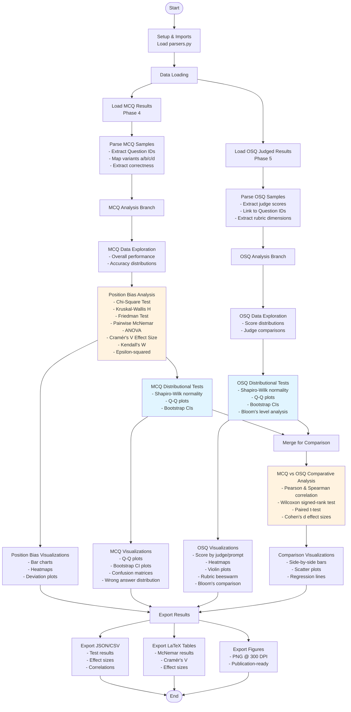

# TODO: Update

# Phase 6: Results Processing & Analysis

This directory contains comprehensive statistical analysis tools for Phase 6 of the dissertation pipeline.

## Overview

Phase 6 aggregates results from all previous phases and performs comprehensive statistical analysis:

1. **Position Bias Analysis** - Detect and quantify position bias in MCQ responses
2. **MCQ-Specific Analysis** - Overall MCQ performance, distributional tests, bootstrap CIs
3. **OSQ-Specific Analysis** - Score distributions, judge comparisons, rubric analysis
4. **MCQ vs OSQ Comparison** - Compare performance across question formats
5. **Statistical Testing** - Normality tests, effect sizes, confidence intervals, correlation analysis
6. **Visualizations** - Publication-ready plots and charts (PNG @ 300 DPI, LaTeX tables)


## Analysis Modules

### 1. Position Bias Analysis

Detects if models have a systematic preference for certain answer positions (A, B, C, D) in multiple-choice questions.

**Statistical Tests:**
- **Chi-Square Test** (`chi2_contingency`): Tests independence between position and correctness
- **Kruskal-Wallis H Test**: Non-parametric alternative to ANOVA across positions
- **Friedman Test**: Non-parametric repeated measures test (same questions, different positions)
- **Pairwise McNemar Tests**: Paired comparisons between position pairs
- **ANOVA** (`f_oneway`): One-way analysis of variance across positions
- **Cramér's V**: Effect size for chi-square tests (0-1 scale)
- **Kendall's W**: Effect size for Friedman test
- **Epsilon-squared (ε²)**: Effect size for Kruskal-Wallis test

**Outputs:**
- `output/kruskal_wallis_results.json` - Kruskal-Wallis test results
- `output/friedman_test_results.json` - Friedman test results
- `output/mcnemar_pairwise_tests.csv` - Pairwise McNemar test results
- `output/cramers_v_effect_sizes.csv` - Cramér's V effect sizes per model
- `output/table_mcnemar_significant.tex` - LaTeX table of significant pairwise tests
- `output/table_cramers_v.tex` - LaTeX table of Cramér's V values
- `output/position_bias_bar.png` - Bar chart showing accuracy by position
- `output/mcq_position_heatmap.png` - Heatmap of model × position accuracy
- `output/mcq_deviation_from_uniform.png` - Deviation from expected uniform (0.25) distribution

**Interpretation:**
- **p-value < 0.05**: Statistically significant position bias
- **Cramér's V > 0.3**: Strong effect
- **Cramér's V 0.1-0.3**: Moderate effect
- **Cramér's V < 0.1**: Weak effect

### 2. MCQ vs OSQ Comparison

Compares model performance across multiple-choice question (MCQ) and open-short question (OSQ) formats.

**Analyses:**
- Overall accuracy comparison (MCQ vs OSQ)
- Correlation analysis by judge model and prompt
- Non-parametric paired comparison tests
- Effect size calculations
- Bootstrap confidence intervals

**Statistical Tests:**
- **Pearson Correlation** (`pearsonr`): Linear correlation between MCQ and OSQ scores
- **Spearman Correlation** (`spearmanr`): Rank-based correlation
- **Wilcoxon Signed-Rank Test**: Non-parametric paired test for MCQ vs OSQ differences
- **Paired t-test** (`ttest_rel`): Parametric paired comparison
- **Cohen's d**: Effect size for MCQ vs OSQ differences

**Outputs:**
- `output/mcq_osq_correlation_by_judge_prompt.csv` - Correlation results by judge and prompt
- `output/wilcoxon_test_results.json` - Wilcoxon test results
- `output/effect_sizes_mcq_vs_osq.csv` - Effect sizes
- `output/effect_sizes_details.json` - Detailed effect size calculations
- `output/table_effect_sizes.tex` - LaTeX table of effect sizes
- `output/mcq_vs_osq_sidebyside.png` - Side-by-side bar comparison
- `output/mcq_vs_osq_scatter.png` - Scatter plot with regression line
- `output/mcq_confusion_matrix_all_models.png` - Confusion matrices for all models
- `output/mcq_wrong_answer_distribution.png` - Stacked bar chart of wrong answers

**Key Metrics:**
- Correlation coefficient (r) - both Pearson and Spearman
- Median difference and test statistics
- Effect sizes (Cohen's d)
- Statistical significance (p-values)

### 3. OSQ-Specific Analysis

Detailed analysis of open-short question (OSQ) evaluation results across different judge models and prompts.

**Analyses:**
- Score distribution by judge model (GPT-4, Claude, etc.)
- Score distribution by prompt variant
- Model performance comparison across judges
- Bloom's taxonomy level analysis (if available)
- Rubric dimension analysis (technical accuracy, conceptual understanding, completeness, clarity, professional relevance)
- Normality and distributional testing
- Bootstrap confidence intervals

**Statistical Tests:**
- **Shapiro-Wilk Test**: Tests normality of OSQ score distributions
- **Bootstrap resampling**: 95% confidence intervals for score estimates

**Outputs:**
- `output/osq_normality_tests.json` - Normality test results
- `output/osq_bootstrap_results.json` - Bootstrap confidence intervals
- `output/osq_scores_by_judge.png` - Box and violin plots by judge
- `output/osq_scores_by_prompt.png` - Box and violin plots by prompt
- `output/osq_model_performance_by_judge_heatmap.png` - Heatmap of model × judge performance
- `output/osq_score_histogram.png` - Distribution of scores with KDE
- `output/osq_violin_scores.png` - Violin plot by model
- `output/osq_beeswarm_rubric.png` - Rubric dimension scores
- `output/osq_blooms_comparison.png` - Performance by Bloom's level
- `output/qq_plot_osq_scores.png` - Q-Q plot for normality assessment
- `output/plot_osq_bootstrap_ci.png` - Bootstrap confidence interval plot

### 4. MCQ-Specific Analysis

Detailed analysis of multiple-choice question (MCQ) performance beyond position bias.

**Analyses:**
- Overall MCQ performance metrics
- Accuracy distribution across models
- Normality and distributional testing
- Bootstrap confidence intervals
- Confusion matrix analysis
- Wrong answer distribution patterns

**Statistical Tests:**
- **Shapiro-Wilk Test**: Tests normality of MCQ accuracy distributions

**Outputs:**
- `output/mcq_normality_tests.json` / `output/mcq_normality_tests.csv` - Normality test results
- `output/mcq_bootstrap_ci.png` - Bootstrap confidence intervals for model accuracies
- `output/qq_plot_mcq_accuracies.png` / `output/qq_plots.png` - Q-Q plots for normality assessment


## References

**Position Bias:**
- Cramér's V effect size interpretation (Cohen, 1988)
- McNemar test for paired nominal data (McNemar, 1947)

**Statistical Tests:**
- Shapiro-Wilk normality test (Shapiro & Wilk, 1965)
- Friedman test for repeated measures (Friedman, 1937)
- Bootstrap confidence intervals (Efron, 1979)

**Effect Sizes:**
- Cohen's d interpretation (Cohen, 1988)
- Hedges' g correction (Hedges, 1981)


## Analysis Workflow




# Analysis Notebook Structure

```
analysis.ipynb (~8,600 lines)
│
├── § 1. Setup and Imports
│   ├── 1.1 Data Structure Reference
│   │   ├── MCQ Sample Structure (Phase 4)
│   │   └── OSQ Judged Sample Structure (Phase 5)
│   └── Import statistical libraries (scipy.stats, pandas, numpy, matplotlib, seaborn)
│
├── § 2. Data Loading
│   ├── Load MCQ results from Phase 4
│   ├── Load OSQ judged results from Phase 5
│   └── Integration with parsers.py
│
├── § 3. MCQ Analysis
│   ├── 3.1 MCQ Data Exploration
│   │   └── Overall performance metrics
│   │
│   ├── 3.2 Overall MCQ Performance
│   │   └── Accuracy distributions by model
│   │
│   ├── 3.3 Position Bias Analysis
│   │   ├── Statistical Test Justification
│   │   ├── Chi-Square Test (Short and Long Tables)
│   │   ├── Kruskal-Wallis H Test
│   │   ├── Friedman Test
│   │   ├── ANOVA Test
│   │   ├── Pairwise McNemar Tests
│   │   ├── Cramér's V Effect Sizes
│   │   ├── Kendall's W Effect Sizes
│   │   ├── Epsilon-squared (ε²) Effect Sizes
│   │   └── Visualizations (bars, heatmaps, deviation plots)
│   │
│   ├── 3.4 MCQ Normality & Distributional Tests
│   │   ├── Shapiro-Wilk Tests
│   │   └── Q-Q Plots
│   │
│   └── 3.5 MCQ Bootstrap Confidence Intervals
│       └── 95% CI estimation via resampling
│
├── § 4. OSQ Analysis
│   ├── 4.1 OSQ Data Exploration
│   │   ├── Score distributions
│   │   └── Judge model comparisons
│   │
│   ├── 4.2 OSQ Score Distribution
│   │   ├── By judge model
│   │   ├── By prompt variant
│   │   └── Model performance heatmaps
│   │
│   ├── 4.3 OSQ Normality & Distributional Tests
│   │   ├── Shapiro-Wilk Tests
│   │   └── Q-Q Plots
│   │
│   └── 4.4 OSQ Bootstrap Confidence Intervals
│       └── 95% CI estimation via resampling
│
├── § 5. MCQ vs OSQ Comparative Analysis
│   ├── 5.1 Comparative Analysis Rationale
│   │   └── Statistical justification for tests
│   │
│   ├── 5.2 Correlation Analysis
│   │   ├── Pearson correlation by judge and prompt
│   │   └── Spearman correlation by judge and prompt
│   │
│   ├── 5.3 Paired Statistical Tests
│   │   ├── Wilcoxon Signed-Rank Test
│   │   └── Paired t-test
│   │
│   ├── 5.4 Effect Size Calculations
│   │   └── Cohen's d for MCQ vs OSQ differences
│   │
│   └── 5.5 Visualizations
│       ├── Side-by-side bar charts
│       ├── Scatter plots with regression
│       ├── Confusion matrices
│       └── Wrong answer distribution
│
└── § 6. Summary Tables & Export
    ├── LaTeX table generation
    ├── JSON/CSV exports
    ├── PNG figure exports (300 DPI)
    └── Output manifest summary
```

## Data Structure Details

### Phase 4 MCQ Sample Structure
```json
{
  "doc_id": 0,
  "doc": {
    "Question ID": 1,
    "Tags": "Introduction to risk",
    "INCOSE Handbook Category": "INCOSEHandbook/.../...",
    "question": "What best describes...",
    "choiceA": "...",
    "choiceB": "...",
    "choiceC": "...",
    "choiceD": "...",
    "answer": "A",
    "label": 0,
    "Justification": "..."
  },
  "target": "A",
  "resps": [["A"]],
  "filtered_resps": ["A"],
  "exact_match": 1.0
}
```

**Key Fields:**
- `doc["Question ID"]`: Unique question identifier (1-286)
- `doc["answer"]`: Correct answer letter (varies per variant)
- `doc["INCOSE Handbook Category"]`: Question category
- `exact_match`: 1.0 (correct) or 0.0 (incorrect)
- `filtered_resps[0]`: Model's parsed answer

### Phase 5 Judged OSQ Sample Structure
```json
{
  "sample_id": 0,
  "phase4_row": {
    "doc_id": 0,
    "doc": {
      "Question ID": 1,
      "osq_prompt": "Define \"uncertainty\" in systems engineering...",
      "expected_answer": "...",
      "full_credit_criteria": "...",
      "partial_credit_criteria": "...",
      "no_credit_criteria": "...",
      "blooms_level": "Remember"
    },
    "resps": [["In systems engineering, ..."]],
    "filtered_resps": ["In systems engineering, ..."]
  },
  "judge": {
    "fields": {
      "technical_accuracy": {"score": 19, "justification": "..."},
      "conceptual_understanding": {"score": 19, "justification": "..."},
      "completeness": {"score": 18, "justification": "..."},
      "clarity_organization": {"score": 18, "justification": "..."},
      "professional_relevance": {"score": 20, "justification": "..."}
    },
    "total_score": 94,
    "max_score": 100,
    "percentage": 94.0
  }
}
```

**Key Fields:**
- `phase4_row.doc["Question ID"]`: Links to MCQ via Question ID
- `phase4_row.resps[0][0]`: Model's OSQ response
- `judge.fields.*`: Multi-dimensional scoring (each out of 20)
- `judge.total_score`: Sum of all field scores (out of 100)

## Implementation Status

### ✅ Completed
- **Data Parsing Functions** (`parsers.py`)
  - MCQ parser for Phase 4 results
  - OSQ parser for Phase 5 judged results
  - Question ID standardization and alignment
  - Variant mapping (a/b/c/d position shuffling)

- **Statistical Analyses**
  - Position bias detection (5 statistical tests + 3 effect size measures)
  - MCQ distributional analysis (normality tests, bootstrap CIs)
  - OSQ distributional analysis (normality tests, bootstrap CIs, judge comparisons)
  - MCQ vs OSQ comparative analysis (correlation, paired tests, effect sizes)

- **Visualizations** (30+ figures)
  - Position bias: bar charts, heatmaps, deviation plots
  - MCQ: Q-Q plots, bootstrap CIs, confusion matrices, wrong answer distributions
  - OSQ: score distributions, judge/prompt comparisons, heatmaps, violin plots, rubric beeswarm, Bloom's comparison
  - MCQ vs OSQ: side-by-side bars, scatter plots with regression

- **Exports**
  - JSON outputs for all statistical tests
  - CSV outputs for effect sizes, correlations, test results
  - LaTeX tables for publication (McNemar, Cramér's V, effect sizes)
  - PNG figures @ 300 DPI for publication

### 📋 File Structure
```
src/phase6_analysis/
├── README.md                         # This file
├── analysis.ipynb                    # Main analysis notebook (~8,600 lines)
├── parsers.py                        # Data parsing utilities
└── output/                           # Generated outputs
    ├── *.json                        # Statistical test results
    ├── *.csv                         # Tabular data and effect sizes
    ├── *.tex                         # LaTeX tables
    └── *.png                         # Publication-ready figures (300 DPI)
```
