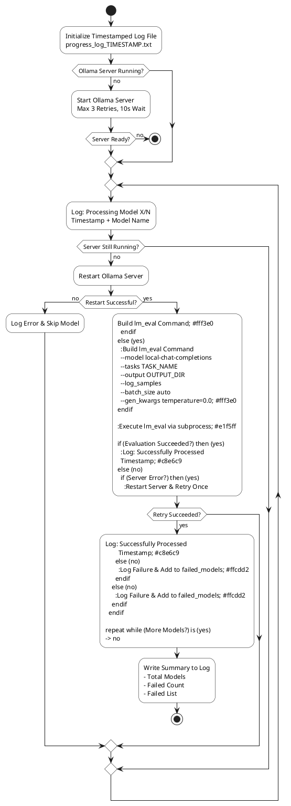
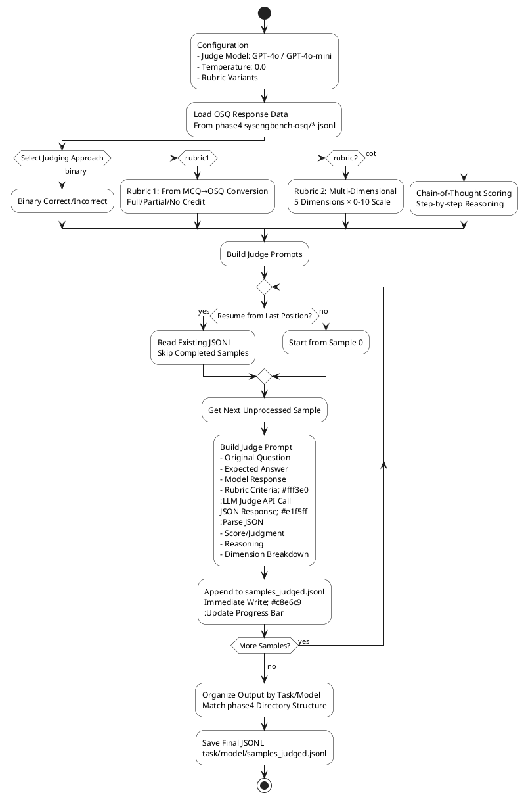
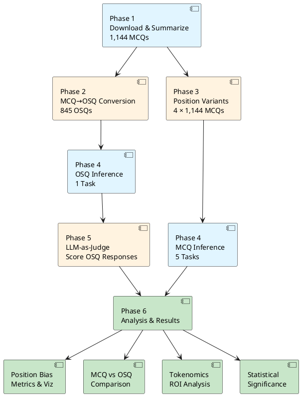

# Architectural Diagrams for Dissertation Methods Section (PlantUML)

This document provides PlantUML versions of the architectural diagrams for each phase of the research pipeline. These diagrams are suitable for inclusion in a dissertation methods section.

---

## Phase 1: Data Preparation

### 1.1 SysEngBench HuggingFace Download (`1.1_sysengbench_hf_download.ipynb`)

**Purpose**: Download the SysEngBench dataset from HuggingFace and store locally.

```plantuml
@startuml phase1_1_download
skinparam activityBackgroundColor #FFFFFF
skinparam activityBorderColor #000000
skinparam activityDiamondBackgroundColor #FFFFFF
skinparam activityStartColor #000000
skinparam activityEndColor #000000

start
:Load Environment Variables;
:Retrieve HF_TOKEN;
:Load Dataset from HuggingFace
rabell/SysEngBench; #e1f5ff
:Extract Test Split
1,144 MCQs;
:Convert to Pandas DataFrame;
:Preview Data
Question, Choices A-D, Answer;
:Save to Local CSV
sysengbench.csv; #c8e6c9
stop

@enduml
```

**Key Operations**:
- Environment: HuggingFace token authentication
- Data Source: `rabell/SysEngBench` repository
- Output: `sysengbench.csv` (1,144 rows × 11 columns)
- Schema: Question ID, Tags, INCOSE Category, Question, ChoiceA-D, Answer, Label, Justification

---

### 1.2 Benchmark Summary Statistics (`1.2_benchmark-summary.ipynb`)

**Purpose**: Analyze and visualize the distribution of questions across INCOSE Handbook categories.

```plantuml
@startuml phase1_2_summary
skinparam activityBackgroundColor #FFFFFF
skinparam activityBorderColor #000000

start
:Load sysengbench.csv or
HuggingFace Dataset;
:Explode INCOSE Categories
Split on newline; #fff3e0
:Parse Category Structure
Category / Sub-Category;
:Calculate Statistics
- Total Questions
- Questions per Category
- Questions per Sub-Category; #e1f5ff
fork
  :Pie Chart: Sub-Categories;
fork again
  :Pie Chart: Categories;
fork again
  :Bar Chart: Sub-Categories
  Horizontal, Sorted;
fork again
  :Bar Chart: Grouped by Category
  Color-coded;
fork again
  :Stacked Bar Chart
  Categories + Sub-Categories;
end fork
:Statistical Output
& Visualizations; #c8e6c9
stop

@enduml
```

**Statistical Outputs**:
- Total Unique MCQs: 1,144
- INCOSE Categories: 6 major categories
- INCOSE Sub-Categories: 20 sub-categories
- Distribution: Cross-Cutting Systems Engineering Methods (276), Specialty Engineering Activities (419), etc.

**Visualizations Generated**:
1. Pie chart showing percentage distribution across sub-categories
2. Pie chart with category-level aggregation
3. Horizontal bar chart ranked by question count
4. Grouped bar chart with category color coding
5. Stacked bar chart showing hierarchy

---

## Phase 2: MCQ to OSQ Conversion

### 2.1 Converting MCQ to OSQ (`2.1_Converting_MCQ_to_OSQ.ipynb`)

**Purpose**: Use an LLM to evaluate MCQ suitability and convert suitable questions to Open-ended Short-answer Questions (OSQ).

```plantuml
@startuml phase2_1_conversion
skinparam activityBackgroundColor #FFFFFF
skinparam activityBorderColor #000000
skinparam activityDiamondBackgroundColor #FFFFFF

start
:Configuration
- Model: GPT-5 via OpenRouter
- Temperature: 0.0
- Threshold: 7/10;
:Load sysengbench.csv
1,144 MCQs;

partition "Classification Phase" {
  repeat
    :Build Classifier Prompt
    5 Dimensions Assessment; #fff3e0
    :LLM API Call
    JSON Response; #e1f5ff
    :Parse JSON
    - Suitability Score 1-10
    - Justification;
    :Log Raw Response;
    if (Score ≥ 7?) then (yes)
      :Mark osq_suitable = Yes;
    else (no)
      :Mark osq_suitable = No;
    endif
  repeat while (More MCQs?) is (yes)
  -> no;
  :Classification Complete
  845/1144 Suitable 74%;
}

partition "Conversion Phase" {
  repeat
    :Build Converter Prompt
    Preserve Intent & Difficulty; #fff3e0
    :LLM API Call
    JSON Response; #e1f5ff
    :Parse JSON
    - OSQ Prompt
    - Expected Answer
    - Rubric Full/Partial/No Credit
    - Bloom's Level + Justification;
    :Log Raw Response;
  repeat while (More MCQs?) is (yes)
  -> no;
}

:Save Complete Dataset;
fork
  :sysengbench_osq.csv
  All 1,144 rows with OSQ columns;
fork again
  :sysengbench_osq.jsonl
  All 1,144 rows;
end fork
:Filter Suitable Only;
:sysengbench_osq_filtered.csv
845 rows; #c8e6c9
stop

@enduml
```

**Two-Stage Pipeline**:

#### Stage 1: Classification
- **Input**: MCQ question text
- **Prompt**: Evaluate 5 dimensions (Assessability, Canonical Answer, Ambiguity, Scope, Intent Preservation)
- **Output**: Suitability score (1-10) + justification
- **Threshold**: Score ≥ 7 proceeds to conversion
- **Result**: 845/1144 (74%) deemed suitable

#### Stage 2: Conversion
- **Input**: Suitable MCQ with all fields
- **Prompt**: Convert while preserving construct and difficulty
- **Rules**:
  - Remove MCQ artifacts (A/B/C/D, "which of the following")
  - Maintain original intent (recall → recall, numeric → numeric)
  - Create canonical expected answer
  - Generate detailed grading rubric
  - Assign Bloom's taxonomy level
- **Output**: OSQ prompt, expected answer, rubric (full/partial/no credit), Bloom's level & justification

**Reliability Mechanisms**:
- Retry logic for JSON parsing failures
- Comprehensive logging (prompts + responses timestamped)
- Separate artifact directories for raw logs and parsed JSON

---

## Phase 3: MCQ Position Variants

### 3.1 MCQ Shift Golden Answer Location (`3.1_MCQ_Shift_Golden.ipynb`)

**Purpose**: Create 4 variants of the MCQ dataset with the correct answer rotated to positions A, B, C, and D to test for position bias.

```plantuml
@startuml phase3_1_variants
skinparam activityBackgroundColor #FFFFFF
skinparam activityBorderColor #000000

start
:Load SysEngBench from HuggingFace
rabell/SysEngBench
1,144 MCQs;

fork
  partition "Variant A" {
    :Rotate Choices
    Circular Shift Algorithm; #fff3e0
    :Update Answer Field = A
    Update Label = 0;
    :Save sysengbench_a.csv;
  }
fork again
  partition "Variant B" {
    :Rotate Choices
    Circular Shift Algorithm; #fff3e0
    :Update Answer Field = B
    Update Label = 1;
    :Save sysengbench_b.csv;
  }
fork again
  partition "Variant C" {
    :Rotate Choices
    Circular Shift Algorithm; #fff3e0
    :Update Answer Field = C
    Update Label = 2;
    :Save sysengbench_c.csv;
  }
fork again
  partition "Variant D" {
    :Rotate Choices
    Circular Shift Algorithm; #fff3e0
    :Update Answer Field = D
    Update Label = 3;
    :Save sysengbench_d.csv;
  }
end fork

:Verification Step
Preview First Row of Each Variant; #c8e6c9
stop

@enduml
```

**Rotation Algorithm**:
```
def rotate(list, k):
    k = k % 4
    return list[-k:] + list[:-k]

Target Position | Current Position | Shift Amount
----------------|------------------|-------------
       A        |        A         |      0
       A        |        B         |      3
       A        |        C         |      2
       A        |        D         |      1
```

**Output Schema** (Same for all 4 variants):
- Columns: Question ID, Tags, INCOSE Category, Question, ChoiceA, ChoiceB, ChoiceC, ChoiceD, Answer, Label, Justification
- Rows: 1,144 (same questions, rotated choices)
- Semantic Equivalence: Maintained across all variants

**Purpose**: Enables detection of position bias by comparing model performance across variants where the only difference is the position of the correct answer.

---

## Phase 4: Model Inference

### 4.1 RunPod Infrastructure Setup (`runpod-on-vm-manual.ipynb`)

**Purpose**: Configure RunPod GPU instances with Ollama for running LLM evaluations.

```plantuml
@startuml phase4_1_runpod
skinparam activityBackgroundColor #FFFFFF
skinparam activityBorderColor #000000

start
:Select RunPod GPU Pod
A40 48GB VRAM;
:Configure Pod
- Template: PyTorch
- Expose Port 11434
- ENV: OLLAMA_HOST=0.0.0.0;
:Set Container & Volume Size
Based on Model Requirements;
:Deploy Pod;
:SSH into Pod;
:Install Dependencies
apt update && apt install lshw;
:Install Ollama
curl ollama.ai/install.sh | sh;
:Start Ollama Server
ollama serve in SSH terminal; #fff3e0
:Switch to Jupyter Interface;
:Install Python Packages
- lm_eval
- ollama==0.3.3;

if (Model Loading Strategy) then (manual)
  :Manual Array Definition
  Based on VRAM Requirements;
else (excel)
  :Excel Import
  Filter by Size < 48GB;
endif

:Model Pull Loop; #e1f5ff
repeat
  :ollama pull model_name
  Sequential Downloads;
repeat while (More models?) is (yes)
-> no;

:Verify Downloaded Models
ollama.list;
:API Connection Test
OpenAI-Compatible Endpoint;
:Ready for Inference; #c8e6c9
stop

@enduml
```

**Infrastructure Configuration**:

**GPU Selection**:
- Single A40 (48GB VRAM): Models up to ~43GB
- 2× A40 (96GB VRAM): Models up to ~90GB
- 3× A40 (144GB VRAM): Largest models (~141GB)

**Software Stack**:
- Base: PyTorch template
- Server: Ollama (local LLM serving)
- Evaluation: lm-evaluation-harness
- API: OpenAI-compatible endpoint at `http://localhost:11434/v1/chat/completions`

**Model Management**:
- Pull models sequentially via `ollama pull`
- Verify with `ollama list()`
- Test with chat completions API before benchmarking

---

### 4.2 Batch Inference Execution (`keep-ollama-running-process.ipynb`)

**Purpose**: Execute lm-evaluation-harness across all models and benchmark variants with error handling and progress tracking.



**Evaluation Configuration** (for each benchmark variant):

**MCQ Tasks** (SysEngBench, SysEngBench-A/B/C/D):
```yaml
task: sysengbench[-a/-b/-c/-d]
output_type: generate_until
doc_to_text: "Given the following question and four candidate answers..."
generation_kwargs:
  temperature: 0.0
  max_tokens: 20
  until: ["</s>", "\n"]
filter_list:
  - regex: "([ABCD])"
  - take_first
metric: exact_match
```

**OSQ Task** (SysEngBench-OSQ):
```yaml
task: sysengbench-osq
output_type: generate_until
doc_to_text: "{osq_prompt}"
generation_kwargs:
  temperature: 0.0
  max_tokens: 2000-10000 (model dependent)
  until: ["</s>"]
# No automatic grading - responses logged for Phase 5 LLM-as-judge
```

**Error Handling**:
- Server health checks before each model
- Automatic restart on connection errors
- Single retry per model on failure
- Comprehensive logging with timestamps
- Failed models tracked separately

**Output Structure**:
```
output/
├── sysengbench/
│   ├── results_TIMESTAMP.json
│   └── samples_TIMESTAMP.jsonl
├── sysengbench-a/
├── sysengbench-b/
├── sysengbench-c/
├── sysengbench-d/
└── sysengbench-osq/
    ├── results_TIMESTAMP.json
    └── samples_TIMESTAMP.jsonl  # Raw responses for judging
```

---

## Phase 5: LLM-as-a-Judge

### 5.1 LLM Judge Evaluation (`llm-judge.ipynb`)

**Purpose**: Score OSQ responses using LLM judges with academically-validated rubrics.



**Judging Approaches**:

#### 1. Binary Correct/Incorrect
- Simple yes/no judgment
- Fast baseline assessment
- Limited nuance

#### 2. Rubric-Based (from Conversion)
- Uses rubric generated in Phase 2
- Full credit: Meets all criteria
- Partial credit: Meets some criteria
- No credit: Fails key requirements

#### 3. Multi-Dimensional Scoring (Lin & Chen 2023)
- **Technical Accuracy** (0-10): Correctness of facts, principles, terminology
- **Conceptual Understanding** (0-10): Depth of systems thinking
- **Completeness** (0-10): Coverage of required elements
- **Clarity** (0-10): Communication quality
- **Professional Relevance** (0-10): Real-world applicability
- **Aggregate**: Mean or weighted average

#### 4. Chain-of-Thought (Zheng et al. 2023, G-Eval)
- Judge explains reasoning step-by-step
- Identifies strengths and weaknesses
- Provides final score with justification
- Higher human agreement (~85-98%)

**Academic Foundations**:
- Based on peer-reviewed methodologies
- Validated against human expert agreement
- Bias mitigation strategies (position, length)
- Integration with Bloom's taxonomy

**Reliability Features**:
- Resume capability: Reads existing JSONL to skip completed samples
- Incremental writes: Each sample written immediately (crash-safe)
- Progress tracking: tqdm progress bar with ETA
- Directory organization: Matches phase4 structure for easy merging

**Output Format** (per sample in JSONL):
```json
{
  "task": "sysengbench-osq",
  "doc_id": 42,
  "question": "...",
  "expected_answer": "...",
  "model_response": "...",
  "judge_model": "gpt-4o",
  "judgment": {
    "score": 8.5,
    "reasoning": "...",
    "technical_accuracy": 9,
    "conceptual_understanding": 8,
    "completeness": 9,
    "clarity": 8,
    "professional_relevance": 9
  }
}
```

---

## Phase 6: Results Processing & Analysis

### 6.1 Comprehensive Results Analysis (`results-processing.ipynb`)

**Purpose**: Aggregate results from all phases, perform statistical analysis, and generate visualizations for position bias, format comparison, and tokenomics.

```plantuml
@startuml phase6_1_analysis
skinparam activityBackgroundColor #FFFFFF
skinparam activityBorderColor #000000

start
:File Inventory Check
Discover all results.json & samples.jsonl
Tasks: sysengbench, a, b, c, d, osq;

fork
  :Load MCQ Results
  sysengbench + variants a/b/c/d;
  :Parse MCQ Samples
  Extract: doc_id, response, target, correct;
fork again
  :Load OSQ Judged Results
  sysengbench-osq;
  :Parse OSQ Samples
  Extract: doc_id, response, judgment, score;
  :Calculate OSQ Metrics
  Aggregate scores per model;
end fork

:Merge with MCQ Data;

if (Detect Thinking Models?) then (yes)
  :Strip <think> tags
  Extract reasoning tokens;
endif

fork
  :Position Bias Analysis;
  :Position Bias Detection
  - Chi-Square Test
  - Kruskal-Wallis H
  - Friedman Test
  - Pairwise McNemar
  - Cramér's V Effect Size; #fff3e0
  :Visualizations: Position Bias
  - Bar charts by position
  - Heatmaps
  - Deviation from expected;
fork again
  :MCQ vs OSQ Comparison;
  :Format Comparison
  - Accuracy: MCQ vs OSQ
  - Correlation Analysis
  - Question-Level Consistency; #fff3e0
  :Visualizations: Format Comparison
  - MCQ vs OSQ accuracy
  - Scatter plots
  - Correlation matrices;
fork again
  :Tokenomics & Cost Analysis;
  :Tokenomics Analysis
  - Token Usage per Sample
  - Cost per Sample
  - Accuracy per Dollar
  - ROI: Thinking vs Standard
  - Break-even Analysis; #e1f5ff
  :Visualizations: Tokenomics
  - Cost vs Accuracy
  - Efficiency Frontiers
  - ROI Curves
  - Break-even Points;
fork again
  :Statistical Testing;
  :Statistical Test Suite
  - Normality Tests: Shapiro-Wilk, Jarque-Bera
  - Effect Sizes: Cohen's d, Hedges' g
  - Bootstrap CI: 10k resamples
  - Q-Q Plots; #e1f5ff
  :Statistical Plots
  - Q-Q Plots
  - Bootstrap Distributions
  - Effect Size Visualizations;
end fork

:Export Analysis CSVs
- position_bias_analysis.csv
- mcq_vs_osq_analysis.csv
- model_detailed.csv per model;
:Export Visualizations
- position_bias_analysis.png
- mcq_vs_osq_analysis.png
- tokenomics_analysis.png
- statistical_tests.png;
:Generate Summary Report
Key Insights:
- Position bias quantification
- Format preference
- Cost-effectiveness thresholds
- Statistical significance; #c8e6c9
stop

@enduml
```

**Analysis Outputs**:

### Position Bias Analysis
- **Metrics**: Accuracy by position (A, B, C, D)
- **Tests**:
  - Chi-Square test for independence
  - Kruskal-Wallis H (non-parametric ANOVA)
  - Friedman test (repeated measures)
  - Pairwise McNemar tests
  - Cramér's V for effect size
- **Outputs**:
  - CSV with per-model position preferences
  - Visualization showing accuracy deviation by position
  - Statistical significance indicators

### MCQ vs OSQ Comparison
- **Metrics**:
  - Overall accuracy: MCQ vs OSQ
  - Per-model correlation
  - Question-level consistency
- **Outputs**:
  - Scatter plots: MCQ accuracy vs OSQ accuracy
  - Correlation matrices
  - CSV with comparative statistics

### Tokenomics & Cost Analysis
- **Metrics**:
  - Average tokens per sample
  - Cost per sample (based on model pricing)
  - Accuracy per dollar (efficiency metric)
  - ROI for thinking models vs standard models
  - Break-even analysis (at what scale does extra accuracy justify extra cost?)
- **Example Insights**:
  ```
  Model            Accuracy  Avg_Tokens  Cost/Sample  Acc/$
  deepseek-r1:7b   0.78      3,245       $0.00097     803
  llama3.2:3b      0.61      187         $0.00002     30,500

  At 10,000 samples:
  - Extra cost: $24.50
  - Extra correct: 1,700
  - Cost per extra correct: $0.0144
  ```
- **Outputs**:
  - Cost vs accuracy scatter plots
  - Efficiency frontier curves
  - ROI curves for different sample sizes
  - CSV with full tokenomics data

### Statistical Testing
- **Normality Tests**: Shapiro-Wilk, D'Agostino's K², Jarque-Bera
- **Effect Sizes**: Cohen's d, Glass's Δ, Hedges' g
- **Confidence Intervals**: Bootstrap with 10,000 resamples
- **Visualizations**: Q-Q plots, distribution plots, effect size charts
- **Interpretation Guidelines**: Negligible/Small/Medium/Large effects

**Final Deliverables**:
1. **CSV Files**: Detailed results for each analysis dimension
2. **Visualizations**: Publication-ready plots in PNG format
3. **Summary Report**: Markdown document with key findings and statistical significance
4. **Decision Framework**: Recommendations for:
   - When to use thinking models
   - Position bias mitigation strategies
   - MCQ vs OSQ format selection
   - Sample size optimization for cost-effectiveness

---

## Data Flow Summary



---

## Notebook Processing Order

**Sequential Dependencies**:

1. **Phase 1.1** → **Phase 1.2** (download before summarize)
2. **Phase 1** → **Phase 2** (base data before conversion)
3. **Phase 1** → **Phase 3** (base data before variants)
4. **Phases 2 & 3** → **Phase 4** (datasets ready before inference)
5. **Phase 4 (OSQ)** → **Phase 5** (responses ready before judging)
6. **Phases 4 & 5** → **Phase 6** (all results ready before analysis)

**Parallelizable**:
- Phase 2 and Phase 3 can run in parallel (independent of each other)
- Phase 4 inference across different tasks can run in parallel (separate evaluation runs)
- Phase 5 judging can process multiple models in parallel (independent samples)

---

## Key Design Patterns Across All Phases

### 1. **Artifact-Based Communication**
- Each phase produces well-defined outputs (CSV, JSONL, YAML)
- Enables phase independence and re-execution
- Clear schema definitions for data interchange

### 2. **Robust Error Handling**
- Retry logic for API calls
- Comprehensive logging with timestamps
- Progress tracking and resume capabilities
- Failed item tracking for post-analysis

### 3. **Academic Rigor**
- Peer-reviewed methodologies referenced
- Statistical significance testing
- Multiple evaluation approaches for validation
- Bloom's taxonomy integration

### 4. **Cost Awareness**
- Token tracking throughout pipeline
- Economic analysis at multiple scales
- ROI modeling for decision support
- Break-even calculations

### 5. **Reproducibility**
- Fixed random seeds where applicable
- Temperature = 0.0 for deterministic outputs
- Versioned datasets on HuggingFace
- Complete configuration documentation

---

## Technical Stack

**Languages & Frameworks**:
- Python 3.11+
- Pandas (data manipulation)
- Datasets (HuggingFace)
- lm-evaluation-harness (benchmarking)
- Matplotlib/Seaborn (visualization)
- SciPy/NumPy (statistical analysis)

**Infrastructure**:
- RunPod (GPU compute)
- Ollama (local LLM serving)
- OpenRouter API (cloud LLM access)
- HuggingFace Hub (dataset hosting)

**Development Environment**:
- Jupyter Notebooks (interactive analysis)
- Git (version control)
- .env (secrets management)

---

## Appendix: File Locations

**Phase 1**:
- `src/phase1_prep/1.1_sysengbench_hf_download.ipynb`
- `src/phase1_prep/1.2_benchmark-summary.ipynb`
- `src/phase1_prep/sysengbench.csv`

**Phase 2**:
- `src/phase2_conversion/2.1_Converting_MCQ_to_OSQ.ipynb`
- `src/phase2_conversion/artifacts_mcq2osq/sysengbench_osq.csv`
- `src/phase2_conversion/artifacts_mcq2osq/sysengbench_osq_filtered.csv`

**Phase 3**:
- `src/phase3_variants/3.1_MCQ_Shift_Golden.ipynb`
- `src/phase3_variants/sysengbench_{a,b,c,d}.csv`

**Phase 4**:
- `src/phase4_inference/runpod-on-vm-manual.ipynb`
- `src/phase4_inference/keep-ollama-running-process.ipynb`
- `src/phase4_inference/*.yaml` (task configurations)
- `src/phase4_inference/output/` (results directories)

**Phase 5**:
- `src/phase5_llm_as_a_judge/llm-judge.ipynb`
- `src/phase5_llm_as_a_judge/sysengbench-osq/` (judged outputs)

**Phase 6**:
- `src/phase6_analysis/results-processing.ipynb`
- Output CSVs and visualizations

---

## Rendering PlantUML Diagrams

To render these diagrams:

1. **Online**: Use [PlantUML Web Server](http://www.plantuml.com/plantuml/)
2. **VS Code**: Install the PlantUML extension
3. **Command Line**:
   ```bash
   java -jar plantuml.jar diagrams.md
   ```
4. **Markdown Preview**: Many markdown renderers support PlantUML (e.g., GitLab, certain Obsidian plugins)

---

*This document was generated for dissertation methods section inclusion. All diagrams use PlantUML syntax for compatibility with LaTeX, Word (via PNG export), and other academic publishing tools.*
