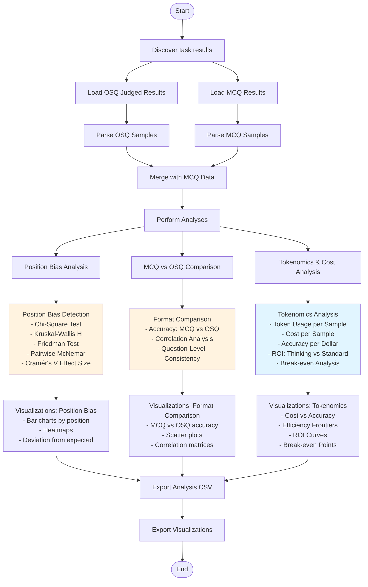

# TODO: Update

# Phase 6: Results Processing & Analysis

This directory contains comprehensive statistical analysis tools for Phase 6 of the dissertation pipeline.

## Overview

Phase 6 aggregates results from all previous phases and performs:

1. **Position Bias Analysis** - Detect and quantify position bias in MCQ responses
2. **MCQ vs OSQ Comparison** - Compare performance across question formats
3. **Tokenomics & Cost Analysis** - Analyze token efficiency and cost-effectiveness
4. **Statistical Testing** - Normality tests, effect sizes, confidence intervals
5. **Visualizations** - Publication-ready plots and charts


## Analysis Modules

### 1. Position Bias Analysis
TODO: UPDATE THIS SECTION 1.

Detects if models have a systematic preference for certain answer positions (A, B, C, D).

**Statistical Tests:**
- **Chi-Square Test**: Tests independence between position and correctness
- **Kruskal-Wallis H Test**: Non-parametric ANOVA across positions
- **Friedman Test**: Repeated measures test (same questions, different positions)
- **Pairwise McNemar Tests**: Paired comparisons between positions
- **Cramér's V**: Effect size measurement (0-1 scale)

**Outputs:**
- `csv/position_bias_analysis.csv` - Statistical test results per model
- `figures/position_bias_heatmap.png` - Heatmap of accuracy by position
- `figures/position_bias_deviation.png` - Deviation from expected uniform distribution (25% per position)

**Interpretation:**
- **p-value < 0.05**: Statistically significant position bias
- **Cramér's V > 0.3**: Strong effect
- **Cramér's V 0.1-0.3**: Moderate effect
- **Cramér's V < 0.1**: Weak effect

### 2. MCQ vs OSQ Comparison
TODO: UPDATE THIS SECTION 2.


Compares model performance across question formats.

**Analyses:**
- Overall accuracy comparison
- Pearson correlation between formats
- Paired t-tests (MCQ vs OSQ for same models)
- Question-level consistency analysis

**Outputs:**
- `csv/mcq_vs_osq_comparison.csv` - Comparative statistics
- `figures/mcq_vs_osq_scatter.png` - Scatter plot (MCQ vs OSQ accuracy)
- `figures/mcq_vs_osq_bars.png` - Side-by-side bar comparison

**Key Metrics:**
- Correlation coefficient (r)
- Mean difference (OSQ - MCQ)
- Statistical significance (p-value)

### 3. Tokenomics & Cost Analysis
TODO: UPDATE THIS SECTION 3.

Analyzes the cost-effectiveness of MCQ vs OSQ formats

**Metrics:**
- Average tokens per sample
- Accuracy per token
- ROI
- Break-even analysis


## References

**Position Bias:**
- Cramér's V effect size interpretation (Cohen, 1988)
- McNemar test for paired nominal data (McNemar, 1947)

**Statistical Tests:**
- Shapiro-Wilk normality test (Shapiro & Wilk, 1965)
- Friedman test for repeated measures (Friedman, 1937)
- Bootstrap confidence intervals (Efron, 1979)

**Effect Sizes:**
- Cohen's d interpretation (Cohen, 1988)
- Hedges' g correction (Hedges, 1981)


## Analysis Workflow




# Analysis Notebook Structure

```
analysis.ipynb
├── § 1. Setup and Imports
│   └── 1.1 Data Structure Reference
│
├── § 2. Data Loading
│   └── (parsers.py integration)
│
├── § 3. Data Exploration
│
├── § 4. Position Bias Analysis (MCQ)
│   ├── Statistical Test Justification
│   ├── Chi-Square Test
│   ├── ANOVA Test
│   ├── 4.3 Cramér's V Effect Size
│   ├── 4.4 Pairwise McNemar Tests
│   ├── 4.5 Normality Tests 
│   ├── 4.6 Q-Q Plot 
│   ├── 4.7 Bootstrap CIs
│   └── Visualizations
│
├── § 5. OSQ Analysis
│   ├── Score distributions
│   ├── Bloom's level analysis
│   └── 5.5 Normality Tests
│
├── § 6. MCQ vs OSQ Comparative Analysis
│   ├── 6.1 Statistical Rationale
│   ├── Correlation analysis
│   ├── Paired t-test
│   ├── 6.2 Wilcoxon Signed-Rank Test
│   ├── 6.3 Effect Size Calculations
│   └── Visualizations
│
└── § 7. Diagnostic and Statistical Plots
    └── Output summary and manifest
```
